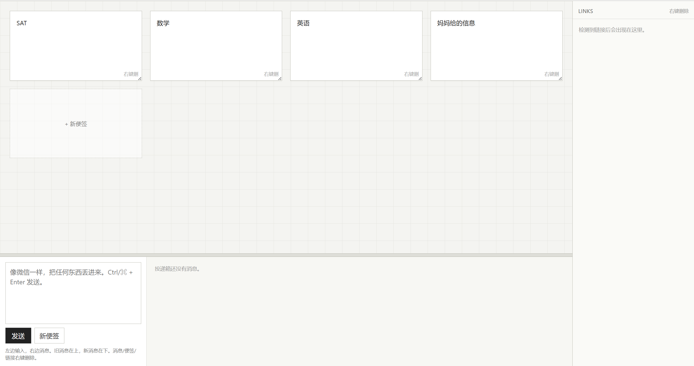

# Infinite Star Station Creative Files

> A collection of personal creative web projects and interface experiments.

存储一些我的创意网页作品，也是 **Infinite Star Station（永恒寒星）** 的附属项目。

这些项目大多诞生于日常灵感，并持续作为个人创意实验进行维护。

---

浏览文件链接如下:
https://alven356.github.io/Infinite-Star-Station-CreativeFiles/index.html

---

## Projects

| Project | Description |
|---------|-------------|
| **PIIN Final** | 图片图库查看器 |
| **Infinite Star Final** | 仿 Linux / macOS 浏览器主页 |
| **Vocab Notebook Final** | 单词测试软件 |
| **Flat Note Wall Inbox** | 便签墙与聊天记录工具 |

---

## 注意事项

> [!WARNING]
>
> - 代码仍然处于实验阶段。
> - 请勿将 CSS 与 HTML 分离。
> - 当前项目建议本地使用，不建议直接部署到服务器。
> - 当前项目还在完善中

---

# PIIN Final

一个用于收藏图片与记录灵感的本地图片图库。

除了保存图片本身，它更像一本可以不断补充内容的数字相册。每张图片都可以记录标题、当时的想法，以及一段属于它自己的故事。

### Features

- 图片收藏与浏览
- 自动按年月整理图片
- 图片标题与备注
- 图片故事记录
- 根据图片色调自动调整页面主题
- Local Storage 数据存储

<strong>Complete Documentation</strong>

### 图片导入

在库存页面上传图片即可将图片添加到网页图库。

可以为图片填写：

- 标题
- 当前这一刻的想法
- 图片下方的一句话

用于长期收藏和记录。

---

### 图片整理

收藏后的图片会自动按照：

- 年份
- 月份
- 时间

进行排序，方便日后回顾。

---

### 图片浏览

进入观察页面即可查看所有图片。

支持：

- 左右方向键切换图片
- 快速浏览全部收藏

---

### 灵感记录

每张图片下方都可以撰写专属小说或记录灵感。

图片不仅是收藏，也可以作为创作的起点。

---

### 动态主题

网页整体色调会根据图片的主要颜色自动变化，使浏览体验更加统一。

---

### 数据存储

所有信息均保存在浏览器 Local Storage 中。

---

# Infinite Star Final

一个受到 **Linux** 与 **macOS** 启发设计的浏览器主页。

它更注重桌面的整体体验，而不是简单地把功能堆积在同一个页面。希望打开浏览器时，能够拥有一个安静、整洁、可以长期使用的起始页。

### Features

- Pomodoro Timer
- Calendar
- Weather
- Music Player
- Dock
- Quick Launch
- Desktop Widgets
- Wallpaper Customization
- Theme Customization
- Local Storage

<strong>Complete Documentation</strong>

### Desktop

主页采用桌面布局设计，灵感来源于 Linux 与 macOS。

支持：

- 自定义壁纸
- 模糊背景
- 亮度调整
- 饱和度调整
- 桌面文字
- 元素显示控制

所有设置都会自动保存。

---

### Widgets

包含多个常用组件，例如：

- 番茄时钟
- 日历
- 天气
- 时钟
- 音乐播放器

所有模块均可独立显示或隐藏。

---

### Dock

底部 Dock 用于快速启动常用网站。

支持：

- 自定义图标
- 修改名称
- 修改链接
- 排序
- 删除

---

### Theme

可自由调整整个页面的视觉效果，包括：

- 背景
- 模糊
- 透明度
- 色彩
- 桌面元素

用于打造不同风格的主页。

---

### Import & Export

支持导入与导出全部配置。

更换浏览器或设备时，可快速恢复个人设置。

---

### Storage

所有数据均保存在浏览器 Local Storage 中，不依赖服务器。

---

# Vocab Notebook Final

一个用于单词整理、记忆与测试的本地学习工具。

它采用词库的形式管理单词，并提供多种测试方式，希望把背单词变成一个可以长期坚持的过程，而不是一次性的任务。

### Features

- Multiple Vocabulary Libraries
- Batch Import
- Manual Test
- Random Test
- Wrong Answer Notebook
- Local Storage

<strong>Complete Documentation</strong>

### Vocabulary Libraries

支持创建多个独立词库，并可自由重命名、删除和排序。

---

### Import

支持批量导入单词。

---

### Test

提供：

- 手动测试
- 随机测试

用于不同阶段的单词复习。

---

### Wrong Answer Notebook

自动整理错题，方便重复练习。

---

### Storage

所有数据均保存在浏览器 Local Storage 中。

---

# Flat Note Wall Inbox

一个用于记录想法、聊天内容与网页链接的轻量级信息整理工具。

相比传统便签，它更偏向于长期的信息积累与快速检索。

### Features

- Sticky Notes
- Chat Recorder
- Link Collection
- Drag & Drop
- Local Storage

<strong>Complete Documentation</strong>

### Sticky Notes

创建多个便签，自由调整位置。

---

### Chat Recorder

以聊天形式记录灵感或日常内容。

---

### Link Collection

保存常用网页链接，便于后续整理。

---

### Storage

所有数据均保存在浏览器 Local Storage 中。

---

## Future Plans

这个仓库仍在持续更新。

未来会继续加入新的创意网页作品，并持续优化现有项目的界面体验与交互设计。

---

## License

目前仅作为个人创意作品展示。

如需参考其中的设计或代码，请注明来源。

---

Made with ❤️ by **Alven**

Infinite Star Station Creative Files
